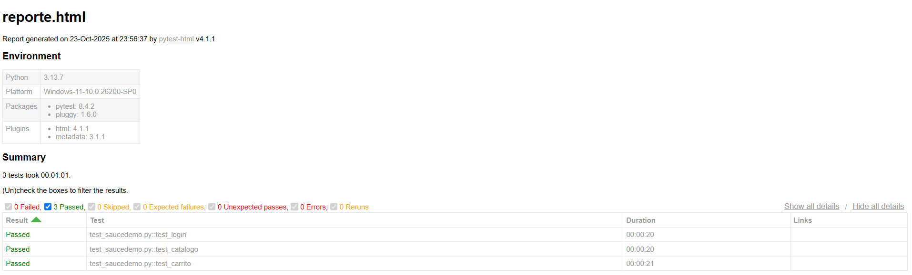
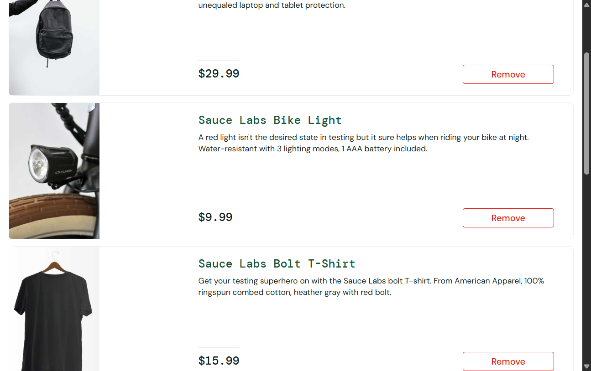

# 🧪 pre-entrega-automation-testing-Gonzalo-Lamas

## El propósito del proyecto

Este proyecto automatiza el flujo de **login**, **validación de productos** y **carrito de compras** en el sitio [SauceDemo](https://www.saucedemo.com/) utilizando **Selenium + Pytest**.

## 🚀 Tecnologías utilizadas
- Python 🐍
- Selenium WebDriver
- Pytest
- Pytest-HTML para reportes

## Cómo instalar las dependencias

1. Cloná el repositorio:
   ```bash
   git clone https://github.com/tuusuario/pre-entrega-automation-testing-Gonzalo-Lamas.git
   cd pre-entrega-automation-testing-Gonzalo-Lamas
2. pip install -r requirements.txt


## Cómo ejecutar las pruebas

1. Ejecutar todas las pruebas:

    pytest -v

2. Ejecutar una prueba específica:

    pytest test/test_saucedemo.py -v

3. Generar un reporte HTML:

    pytest test/test_saucedemo.py -v --html=reporte.html

## Evidencias - Reportes




